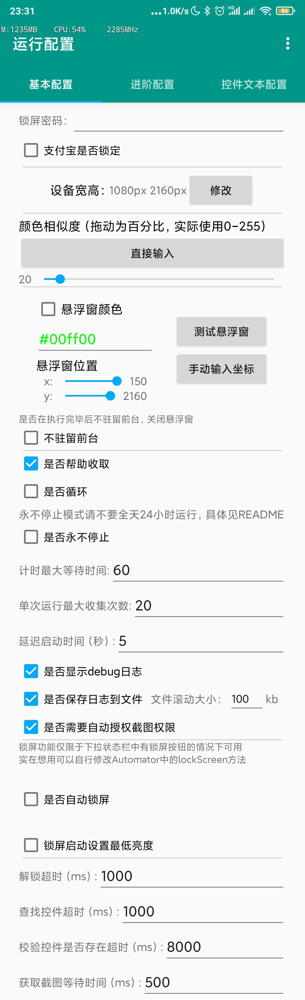
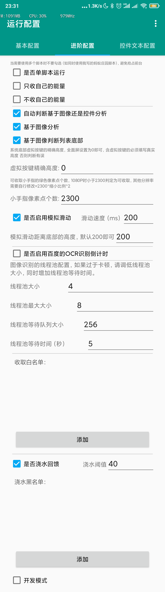
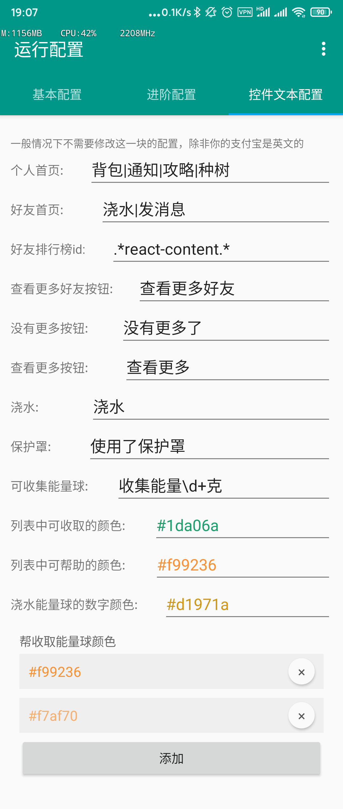
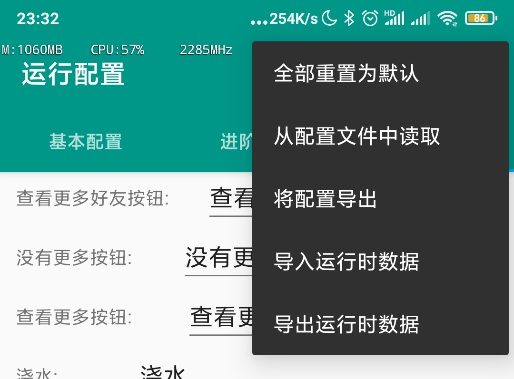

# 简介

本项目从[https://github.com/Nick-Hopps/Ant-Forest-autoscript](https://github.com/Nick-Hopps/Ant-Forest-autoscript) fork 而来，但是经过了各种改动，和原版功能差异较大 现在已经单独复制不再作为fork分支开发

基于 Autojs 的蚂蚁森林自动收能量脚本，采用 4.1.1 Alpha2 版本开发。解锁模块参考自：[https://github.com/e1399579/autojs](https://github.com/e1399579/autojs)

- 脚本执行依赖于：[AutoJs 4.1.1 alpha2](https://www.dropbox.com/s/pe3w53k0fugo1fa/Autojs%204.1.1%20Alpha2.apk?dl=0)
- 不同手机的解锁方法不同可能不适配，需要自行编写解锁方法，具体见`添加解锁设备`小节

## 其他脚本

- [蚂蚁庄园传送门](https://github.com/TonyJiangWJ/Ant-Manor)
- [支付宝积分签到传送门](https://github.com/TonyJiangWJ/Alipay-Credits)
- [京东签到传送门](https://github.com/TonyJiangWJ/JingDongBeans)
- 拆分出来了基础项目，用于快速开发AutoJS脚本[AutoScriptBase](https://github.com/TonyJiangWJ/AutoScriptBase)

## 功能

- 自动匹配不同系统下自动化的方式，安卓 7 及以上通过无障碍服务模拟操作，以下版本通过 root 权限模拟操作；
- 自动识别屏幕锁定方式并根据配置的密码解锁，支持图形解锁，PIN 解锁，混合密码解锁；
- 同时支持支付宝手势解锁
- 识别自己能量球的倒计时，和好友列表中的倒计时做对比，取最小值作为下次收取的等待时间；
- 识别好友能量罩，下一次收取时跳过开启能量罩的好友；
- 默认使用倒计时收取，可通过配置打开循环收取；
- 可选择永不停止模式，无倒计时或超过激活时间则在激活时间之后继续执行，否则按倒计时时间等待，实现全天不间断收集；
- 根据设置选择是否帮助好友收取能量；
- 根据白名单实现不收取特定好友能量；
- 可以设定收取达到一定阈值后自动浇水回馈 默认阈值当日收集超过40克即浇水一次，同时可配置不浇水回馈的黑名单
- 脚本运行时可以显示悬浮窗展示当前状态
- 开始收集的时候按 `音量减` 可以延迟五分钟再执行，适合需要使用手机的时候使用，按 `音量加` 则关闭脚本
- 收取完毕后悬浮框显示收取的能量数量
- 可以自动打开无障碍，需要配合adb赋权 `adb shell pm grant org.autojs.autojs android.permission.WRITE_SECURE_SETTINGS`
- ROOT设备可以实现自动锁屏，非ROOT设备需要修改 `Automator.js` 中的lockScreen方法，默认实现的是下拉状态栏中指定位置放了个锁屏按键
- 脚本更新 可以执行`update/检测更新.js`
- 相对完善的基于图像分析的收取，倒计时无法直接获取，请申请百度识图API或者通过永不停止模式来定时轮询。另外注意永不停止模式不要全天运行，1-6点执行无意义且可能封号。
- 加入开关，可以自动识别基于图像分析还是控件分析，好友数较多的建议直接使用图像分析
- 个人首页、好友首页等等都是基于控件信息识别的，如使用英文版的请运行配置，修改 `控件文本配置` 中的控件文本信息，中文版识别失败的也需要自行配置
- 加入了基于百度文字识别的接口 来识别倒计时数据
  - [通用文字识别](https://ai.baidu.com/tech/ocr/general)
  - 进过测试通用文字识别没法识别，但是网络图片识别接口可用，但是可惜的是每天只有500次的免费调用机会
  - 因此设置中加入了对倒计时绿色像素点的判断，像素点越多则代表倒计时的数值越小，这个时候可以进一步通过百度的接口判断实际的时间
  - 具体运行config.js 勾选百度OCR识别然后填写你申请的APIKey和SecretKey即可，上面的阈值随你设置，反正记住每天只有500次就对了
  - 注意APIKey和SecretKey一定要自己进入AI平台申请，不填写是无效的
- `util` 下提供了多个自定义模式的切换脚本，执行后会自动打断当前运行中的脚本然后按新的设置启动。
  - `自定义1永不停止.js` 30分钟轮询一次，有倒计时按倒计时时间执行，适合9-23点。可以对它设置每天9点的定时任务
  - `自定义2计时停止.js` 按倒计时时间执行，最长等待时间60分钟，适合早上执行和晚上23点执行，避免0点后继续无意义的永不停止。可以对它设置7点、23点以及0点的定时任务
  - `自定义3循环千次只收自己.js` 循环收集自己的，适合自己能量快要生成的时候执行，因为每天步行能量生成时间是固定的，因此在生成前一分钟设置定时任务即可，2分钟后再设置启动`自定义2计时停止.js`

## 更新记录

- 历史版本更新记录可前往[RELEASES 页面](https://github.com/TonyJiangWJ/Ant-Forest/releases) 和 [RELEASES(旧仓库)](https://github.com/TonyJiangWJ/Ant-Forest-autoscript/releases) 查看
- `新增` 加入自动识别基于控件还是图像分析的开关，好友数较多的直接使用基于图像分析即可
- `20191221-新增` 支持支付宝手势密码解锁，勾选 `支付宝是否锁定` 然后填入手势顺序经过的九宫格数字，每个数字都需要填写，比如手势为简单的Z 则输入`1235789`
- `20191221-新增` 截图权限相关默认 `获取截图等待时间` 是500毫秒，如果经常失败请修改该值 改大一些
- `20200110-新增` 加入配置导出和导入的功能，通过AES加密，默认密码是 `device.getAndroidId()`，因此仅本机可用。如果需要跨设备或者免费版和Pro版之间备份，自行获取 `device.getAndroidId()` 然后根据提示输入即可

## 使用

- 下载安装 [AutoJs 4.1.1 alpha2 下载](https://www.dropbox.com/s/pe3w53k0fugo1fa/Autojs%204.1.1%20Alpha2.apk?dl=0) 之后把整个脚本项目放进 **"/sdcard/脚本/"** 文件夹下面。打开软件后下拉刷新，然后运行项目或者 main 即可。
- 给与软件必要权限 `后台弹出界面`、`显示悬浮窗`、`自启动`，并将软件保持后台运行
- 定时启动脚本，点击 `main.js` 的菜单，选择 `更多` `定时任务` 即可配置定时启动
- 如果运行提示有任务正在队列中，请运行配置 `config.js` 然后进到 `进阶配置` 中勾选 `单脚本运行`，该功能是用于多个脚本同时运行时的任务队列 相当于一个调度程序，避免多个脚本抢占前台导致出错
- 默认配置下会自动判断基于控件还是图像识别的方式来执行，好友数量较少的（100左右）直接通过控件分析就行，但是好友数量较多的基于控件分析的会特别卡顿需要开启基于图像分析，具体参考下述配置说明

## 配置

运行 config.js 后可以看到如下配置：

- 常用配置都在基本配置中，可以设置悬浮窗颜色 位置等
- 运行配置后右上角菜单可以重置所有配置信息为默认值
- 运行配置后可以看到百度API调用总次数和剩余次数
- 配置导出导入功能，点击右上角菜单即可导出当前配置到local_config.cfg中，默认已加密加密密码为device.getAndriodId() 如果需要在免费版和付费版AutoJS之间同步 需要自行输入密码
- 运行时数据导出导入功能同上所述









## 常见问题

- config.js 执行异常，运行 `util/功能测试-重置默认配置.js` 依旧有问题，尝试重启AutoJS，并检查AutoJS的版本是否为 `4.1.1 Alpah2` 或者 `较新版本的AutoJS Pro`
- 如果报错 `Function importClass must be called with a class;...` 直接强制关闭AutoJS软件，然后再打开即可。一般只在跨版本更新后才会出现这个问题
- 另外如果不断的运行异常，强制关闭AutoJS软件后重新执行脚本。同时建议定期强制关闭AutoJS软件，避免内存不断增长导致卡顿
- 排行榜卡住不动，修改模拟滑动参数 `滑动速度` 和 `模拟滑动距离底部的高度`
- 排行榜列表底部卡住，一般是虚拟按键的存在导致的，需要修改虚拟按键高度，或者关闭 `基于图像判断列表底部`，修改 `排行榜下拉次数` 次数为总好友数除以8左右，具体自行调试
- 图像分析模式 如果识别有遗漏，尝试将 `颜色相似度` 调低 当前默认值已改为20，或者将 `小手像素点个数` 调高也可以
- 软件的定时任务，点击main.js的 三个点菜单->更多->定时任务 然后设置相应的时间即可
- 排行榜判断失效请修改控件文本配置中的 `校验排行榜分析范围` 具体数据可以通过运行 `util/悬浮窗框位置.js` 来获取，运行后点击悬浮窗即可调整位置和大小。
  
- 其他问题可以提ISSUE，但是请将日志文件大小调整为1024，打开开发模式并提供出错位置的日志信息，包括 `logs/develop.log` 和 `logs/log-verbose.log`

## 添加解锁设备

- 脚本根目录下新建extends文件夹，然后创建ExternalUnlockDevice.js文件，内容格式如下自定义
- 更多扩展可以参考`extends/ExternalUnlockDevice-demo.js`

```javascript
module.exports = function (obj) {
  this.__proto__ = obj

  this.unlock = function(password) {
    // 此处为自行编写的解锁代码

    // 在结尾返回此语句用于判断是否解锁成功
    return this.check_unlock()
  }

}
```

## 注意事项

解锁仅支持：

- 具有 ROOT 权限的安卓 5.0 及以上版本
- 没有 ROOT 权限的安卓 7.0 及以上版本

## 目前存在的问题

- ~目前部分支付宝版本无法识别控件，因此无法使用~ 已加入图像分析
- 部分个人首页可能无法获取控件信息，因此无法使用
