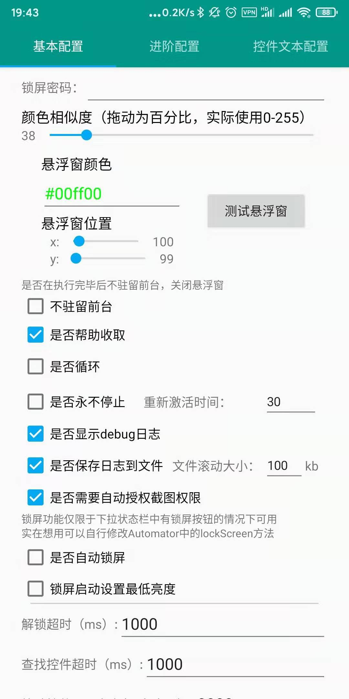
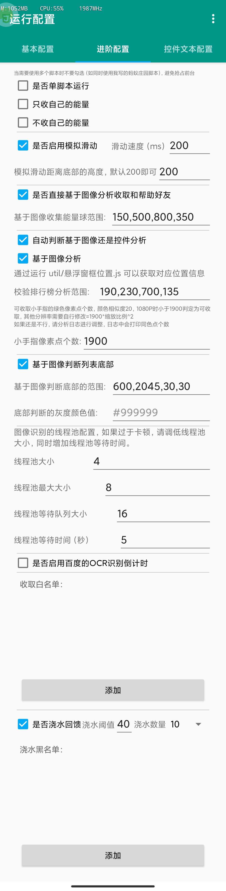
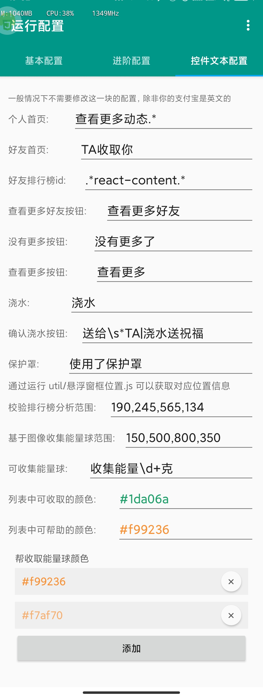

# 其他脚本
- [蚂蚁庄园传送门](https://github.com/TonyJiangWJ/Ant-Manor)
# 简介

基于 Autojs 的蚂蚁森林自动收能量脚本，采用 4.1.1 Alpha 版本开发。解锁模块参考自：https://github.com/e1399579/autojs

- 经过测试小米 mix2s 可以使用 4.0.4alpha 版本,4.0.5alpha 会报错
- 找到最新版了 经过测试可以执行。建议下载该版本，可以直接设置定时任务，而不需要通过脚本中的定时启动方式。自备梯子：[AutoJs 4.1.1 alpha2 下载](https://www.dropbox.com/s/pe3w53k0fugo1fa/Autojs%204.1.1%20Alpha2.apk?dl=0)

## 更新记录

- 本项目从https://github.com/Nick-Hopps/Ant-Forest-autoscript fork 而来，但是经过了各种改动，和原版功能差异较大 现在已经单独复制不再作为fork分支开发
- 历史版本更新记录可前往[RELEASES 页面](https://github.com/TonyJiangWJ/Ant-Forest/releases) 查看

# 使用

- 下载安装 [AutoJs 4.1.1 alpha2 下载](https://www.dropbox.com/s/pe3w53k0fugo1fa/Autojs%204.1.1%20Alpha2.apk?dl=0) 之后把整个脚本项目放进 **"/sdcard/脚本/"** 文件夹下面。打开软件后下拉刷新，然后运行项目或者 main 即可。

# 功能

- 自动匹配不同系统下自动化的方式，安卓 7 及以上通过无障碍服务模拟操作，以下版本通过 root 权限模拟操作；
- 自动识别屏幕锁定方式并根据配置的密码解锁，支持图形解锁，PIN 解锁，混合密码解锁；
- 识别自己能量球的倒计时，和好友列表中的倒计时做对比，取最小值作为下次收取的等待时间；
- 识别好友能量罩，下一次收取时跳过开启能量罩的好友；
- 默认使用倒计时收取，可通过配置打开循环收取；
- 根据设置选择是否帮助好友收取能量；
- 根据白名单实现不收取特定好友能量；
- 脚本运行时可以显示悬浮窗展示当前状态
- 开始收集的时候按音量减可以延迟五分钟再执行，适合需要使用手机的时候使用
- 收取完毕后悬浮框显示收取的能量数量。
- 可以自动打开无障碍，需要配合adb赋权 `adb shell pm grant org.autojs.autojs android.permission.WRITE_SECURE_SETTINGS`
- 可以自动打开脚本执行之前的APP 增强体验，获取失败时通过返回最小化支付宝实现同样效果
- 脚本更新 可以执行`update/检测更新.js`

# 配置

运行 config.js 后可以看到如下配置：

- 常用配置都在基本配置中，可以设置悬浮窗颜色 位置等







# 添加解锁设备

在 Unlock.js 中，按照以下格式扩展：

```javascript
var Devices = {
  device_1: function(obj) {
    this.__proto__ = obj;

    this.unlock = function(password) {
      if (typeof password !== "string") throw new Error("密码应为字符串！");

      // 此处为解锁的代码

      return this.check_unlock();
    }
  },
  device_2: function(obj) {
    ...
  },
  device_3: function(obj) {
    ...
  }
}
```

上述所示为最简单的解锁模板，也可以参考 Unlock.js 默认多解锁方式的代码进行修改。

然后在下方的 MyDevice 中设置解锁设备：

```javascript
var MyDevice = Devices.device_1
```

# 注意事项

解锁仅支持：

- 具有 ROOT 权限的安卓 5.0 及以上版本
- 没有 ROOT 权限的安卓 7.0 及以上版本

# 目前存在的问题

- 目前部分支付宝版本无法识别控件，因此无法使用
