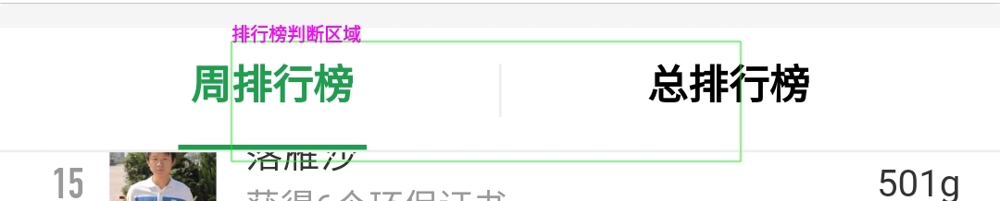
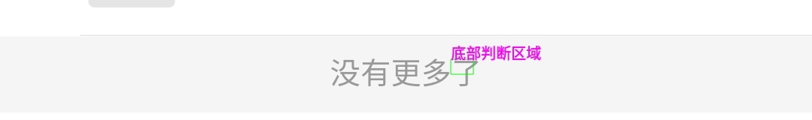
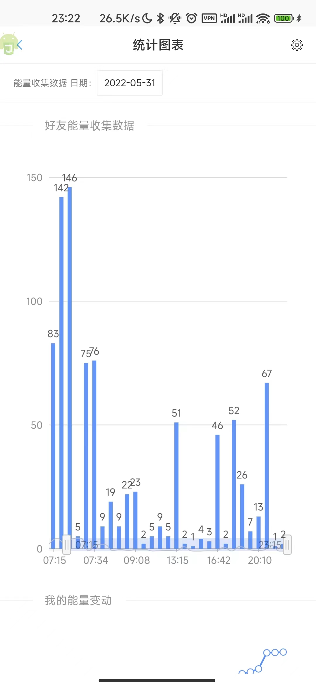
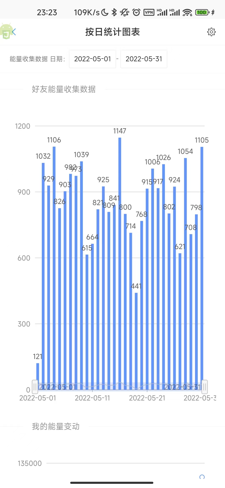

# 简介

基于 Autojs 的蚂蚁森林自动收能量脚本，采用 [AutoJS Modify](https://github.com/TonyJiangWJ/Auto.js/releases/download/v4.1.1/AutoJS.Modify.latest.apk)  版本开发。解锁模块参考自：[https://github.com/e1399579/autojs](https://github.com/e1399579/autojs)

- 脚本执行依赖于：AutoJs 4.1.1 alpha2（非完全兼容） 或者 [AutoJS Modify](https://github.com/TonyJiangWJ/Auto.js/releases/download/v4.1.1/AutoJS.Modify.latest.apk)  建议下载该版本，4.1.1原作者完全不会再维护了，存在较多内存泄露等问题，且不支持Android12 脚本中部分特性也不支持，如本地OCR 多分辨率找图 等等
- 本项目原始版本 [https://github.com/Nick-Hopps/Ant-Forest-autoscript](https://github.com/Nick-Hopps/Ant-Forest-autoscript) ，原作者已不再维护。虽然目前版本和原始版本代码已经完全不一样，但是还是非常感谢 [Nick-Hoops](https://github.com/Nick-Hopps)
- 设备系统要求

  - 具有 ROOT 权限的安卓 5.0 及以上版本
  - 没有 ROOT 权限的安卓 7.0 及以上版本
  - 因为图色识别的原因不支持护眼模式、暗色模式等。
- 觉得本项目好用的话请给个star吧~

## 其他脚本

- [蚂蚁庄园传送门](https://github.com/TonyJiangWJ/Ant-Manor)
- [聚合签到-签到薅羊毛](https://github.com/TonyJiangWJ/Unify-Sign)
- 拆分出来了基础项目，用于快速开发AutoJS脚本[AutoScriptBase](https://github.com/TonyJiangWJ/AutoScriptBase)

## 使用

- 下载安装 AutoJs 4.1.1 alpha2 or [AutoJS Modify](https://github.com/TonyJiangWJ/Auto.js/releases/download/v4.1.1/AutoJS.Modify.latest.apk) 之后把整个脚本项目放进 **"/sdcard/脚本/"** 文件夹下面。打开软件后下拉刷新，然后运行项目或者 `main.js` 即可。
- 给与软件必要权限 `后台弹出界面`、`显示悬浮窗`、`自启动`、`电量无限制`，并将软件保持后台运行
- 定时启动脚本，点击 `main.js` 的菜单，选择 `更多` `定时任务` 即可配置定时启动
- 如果运行提示有任务正在队列中，请运行配置 `可视化配置.js` 然后进到 `高级设置` 中勾选 `单脚本运行`，该功能是用于多个脚本同时运行时的任务队列 相当于一个调度程序，避免多个脚本抢占前台导致出错
- 默认配置下已开启基于图像识别的方式来执行，当前因为森林更新基于控件方式基本不再可用，后续会直接移除相关代码。更多配置信息见[配置小节](#配置)
- 运行有问题请查看[#常见问题小节](#常见问题)
- 不同手机的解锁方法不同可能不适配，需要自行编写解锁方法，具体见[#添加解锁设备](#添加解锁设备)小节
- 首次使用时，脚本需要自动识别图色信息，会在排行榜底部来回上下滚动多次，属于正常现象，请耐心等待脚本自动完成第一轮收集。如果存在其他异常报错，欢迎提交issue。

## 配置

运行 `可视化配置.js` 后可以看到如下配置：

- 常用配置按不同类别进行分组，按实际内容进入对应菜单项目即可
- 所有列表项都可以左滑触发删除或修改，部分输入框也能左滑触发高级输入操作如区域配置和颜色值配置等，多多摸索
- 运行配置后右上角菜单可以重置所有配置信息为默认值
- 配置导出导入功能，点击右上角菜单即可导出当前配置到local_config.cfg中，默认已加密加密密码为device.getAndriodId() 如果需要在免费版和付费版AutoJS之间同步 需要自行输入该密码
- 运行时数据导出导入功能同上所述
- **重要** 基于图像分析模式必须按如下配置，否则脚本无法正常执行
- 好友首页的能量球无法通过控件识别，请进行如下配置：
- 排行榜可收取信息如果自动识别失败，请手动开启 `基于像素点个数判断小手` 并配置像素点阈值
- 图像识别区域信息可以在运行可视化配置.js之后进入 `图像识别相关配置` 直接点击 `实时查看可视化配置信息` 按钮来刷新配置并显示当前的框选区域。也可以在配置完之后可以运行`test/全局悬浮窗显示-配置信息.js` 查看配置生效状况，可在 `resources` 目录下截图保存 `region_check.jpg` ，然后可以悬浮窗显示半透明信息，方便在运行 `可视化配置.js` 时拖动进度条快速调整具体区域
- 区域信息输入框可以左滑，以显示可拖动控件
- 请确保框选区域符合如下样例
- ~~排行榜区域框选如下所示~~ 排行榜识别区域现在可以运行时自动设置，该配置为自定义优化保留 框选区域可以运行 `unit/灰度取色.js` 进行获取

- ~~底部区域框选住 `了` 的上半部分；或者选择其他区域，并配置相应的颜色值，比如 `邀请` 按钮~~ 当前可以在运行时自动设置，该配置为自定义优化保留


- 更多其他配置信息请运行 `可视化配置.js` 后自行摸索

## 功能

- 自动匹配不同系统下自动化的方式，安卓 7 及以上可以通过无障碍服务模拟操作，7以下版本需要通过 root 权限模拟操作；
- 自动识别屏幕锁定方式并根据配置的密码解锁，支持图形解锁，PIN 解锁，混合密码解锁；特殊设备需要自行扩展，具体见[#添加解锁设备](#添加解锁设备)小节
- 同时支持支付宝手势解锁
- 识别自己能量球的倒计时，和好友列表中的倒计时做对比，取最小值作为下次收取的等待时间；
- 识别好友能量罩，下一次收取时跳过开启能量罩的好友；
- 默认使用倒计时收取，可通过配置打开循环收取；
- 可选择永不停止模式，无倒计时或超过激活时间（激活时间可以设置为随机范围）则在激活时间之后继续执行，否则按倒计时时间等待，实现全天不间断收集；
- 根据白名单实现不收取特定好友能量；
- 可以设定收取达到一定阈值后自动浇水回馈 默认阈值当日收集超过40克即浇水一次，同时可配置不浇水回馈的黑名单
- 浇水回馈数量可配置，可选：`10` `18` `33` `66`
- 脚本运行时可以显示悬浮窗展示当前状态
- 开始收集的时候按 `音量减` 可以延迟五分钟再执行，适合需要使用手机的时候使用，按 `音量加` 则关闭脚本终止执行
- 收取完毕后悬浮框显示收取的能量数量
- 支持切换小号进行能量收集和能量雨，运行 `可视化配置` 进入 `多账号管理` 增加支付宝账号并设置昵称用于能量雨自动赠送，并勾选一个主账号。需要确保增加的账号在当前设备可以免密切换。
- 支持刷步数，运行 `可视化配置` 进入 `刷步数` 增加账号和密码信息，具体请见配置界面说明
- 设置完毕后可以手动执行或者设置每天的定时任务
  - 自动收集 `unit/循环切换小号并收集能量.js` 支持小号给大号浇水
  - 自动循环执行能量雨 `unit/循环切换小号并执行能量雨收集.js`
  - 自动同步设备步数 `unit/循环切换小号用于同步数据.js` 如使用 `刷步数` 可以放弃次脚本
  - 通过小米运动刷步数 `unit/小米运动刷步数.js` 支持pushplus推送随机步数结果
- 可以自动打开无障碍，需要配合adb赋权，不同的软件请自行替换包名: Pro版为 `org.autojs.autojspro` 可以通过 `context.getPackageName()` 获取

  ```shell
    adb shell pm grant org.autojs.autojs android.permission.WRITE_SECURE_SETTINGS
  ```

- [通过ADB授权脚本自动获取无障碍权限](https://github.com/TonyJiangWJ/AutoScriptBase/blob/master/resources/doc/ADB%E6%8E%88%E6%9D%83%E8%84%9A%E6%9C%AC%E8%87%AA%E5%8A%A8%E5%BC%80%E5%90%AF%E6%97%A0%E9%9A%9C%E7%A2%8D%E6%9D%83%E9%99%90.md)
- ROOT设备可以实现自动锁屏，非ROOT设备理论上安卓9以上都可以通过无障碍进行锁屏，如果无障碍锁屏失败需要扩展锁屏方法，具体见[#添加自定义锁屏代码](#添加自定义锁屏代码)，默认实现的是下拉状态栏中指定位置放了个锁屏按键
- 脚本更新 可以执行`update/检测更新.js`，也可以运行可视化配置后点击右上角菜单调出弹窗进行更新。
- 可以将配置数据以及运行时数据进行导入和导出，内容通过AES加密，默认密码是 `device.getAndroidId()`，因此仅本机可用。如果需要跨设备或者免费版和Pro版之间备份，自行获取 `device.getAndroidId()` 然后根据提示输入即可
- 通话状态监听，当通话中或者来电时自动延迟五分钟执行，需要授予AutoJS软件获取通话状态的权限[该功能暂不可靠，且Pro版无法使用]
- 可以配置在锁屏状态下判断设备姿势，防止在裤兜内误触（基于重力加速度传感器）
- 提供模拟的OCR识别服务，用于识别倒计时数字，如果觉得准确率欠佳可以选择申请百度OCR接口权限
- 基于图像分析收取时，排行榜倒计时无法直接获取，默认使用模拟OCR，如果识别不准请申请百度识图API。或者通过永不停止模式来定时轮询。另外注意永不停止模式不要全天运行，1-6点执行无意义且可能封号。
- 基于百度文字识别的API接口 来识别倒计时数据
  - [通用文字识别](https://ai.baidu.com/tech/ocr/general)
  - 经过测试通用文字识别没法识别，但是网络图片识别接口可用，但是可惜的是每天只有500次的免费调用机会
  - 因此设置中加入了对倒计时绿色像素点的判断，像素点越多则代表倒计时的数值越小，这个时候可以进一步通过百度的接口判断实际的时间
  - 具体运行可视化配置.js 勾选百度OCR识别然后填写你申请的APIKey和SecretKey即可，上面的阈值随你设置，反正记住每天只有500次就对了
  - 注意APIKey和SecretKey一定要自己进入AI平台申请，不填写是无效的
- `unit` 下提供了多个自定义模式的切换脚本，执行后会自动打断当前运行中的脚本然后按新的设置启动。
  - `自定义1永不停止.js` 25-35分钟的随机范围轮询一次，有倒计时按倒计时时间执行，适合9-23点。可以对它设置每天9点的定时任务
  - `自定义2计时停止.js` 按倒计时时间执行，最长等待时间60分钟，适合早上执行和晚上23点执行，避免0点后继续无意义的永不停止。可以对它设置7点、23点以及0点的定时任务
  - `自定义3循环千次只收自己.js` 循环收集自己的，适合自己能量快要生成的时候执行，因为每天步行能量生成时间是固定的，因此在生成前一分钟设置定时任务即可，然后再设置2分钟后的定时任务`自定义2计时停止.js`
  - 其他自定义方式请自行创建，内容参考以上文件和config.js中的字段
- 支持能量收集统计 查看每天能量值增量和收集好友能量数据 参考如下：
  
  

### 循环/计时模式、永不停止模式等详细说明

- 循环模式：脚本会根据设置的次数不间断的循环执行直到当前执行了指定次数之后便会停止。
- 计时模式：当关闭循环模式，且不开启永不停止模式时，启用计时模式。计时模式需要设置最大等待时间，默认为60分钟，脚本执行时会通过OCR识别排行榜中的倒计时时间，如果得到的最小倒计时时间小于最大等待时间，那么脚本将会按识别到的最小倒计时计时启动，否则脚本将退出执行。
- 永不停止模式：关闭循环模式并开启永不停止，此时需要设置重新激活时间，当识别到的倒计时时间小于这个重新激活时间时，脚本会按实际倒计时计时启动，当识别到的倒计时时间大于重新激活时间时，则按重新激活时间来计时启动。以此循环实现全天不间断的执行。这个重新激活时间可以设置为一个随机范围，每次判断都会在指定范围内生成一个随机的时间。
- 以上计时模式和永不停止模式依赖于OCR的正常运行，如果设备分辨率为1080P的建议直接将自建OCR识别和百度OCR识别关闭，此时会启用模拟的识别，准确率和速度都相较OCR来说更理想。其他分辨率设备则没怎么测试过，自行斟酌。

### 能量雨收集

- 增加了自动收集能量雨的脚本。运行 `unit/能量雨收集.js` 也可以在可视化配置中打开。然后打开能量雨界面，并手动开始，点击开始脚本会自动识别并点击
- *执行逛一逛收集时，脚本会自动启动能量雨收集。可配置自动赠送好友机会以获得一次能量雨机会，好友名支持正则匹配
- 能量雨为暴力点击，基本百分百能得到满分。
- 配合 `多账号管理` 和 `unit/循环切换小号并执行能量雨收集.js` 可以实现每天自动收集小号的能量雨

## 常见问题

- 可视化配置.js 执行异常，运行 `unit/功能测试-重置默认配置.js` 依旧有问题，尝试重启AutoJS，并检查AutoJS的版本是否为 `4.1.1 Alpah2` 或者 [AutoJS Modify](https://github.com/TonyJiangWJ/Auto.js/releases/download/v4.1.1/AutoJS.Modify.latest.apk) 或 `AutoJS Pro7` ，`AutoJS Pro8/9` 由于限制了支付宝控件，暂不能完全支持。
- 可视化配置 运行后显示白屏或者显示 加载失败 大概是因为某个网络资源加载失败了，请退出重新打开，多试几次即可。
- 如果报错 `Function importClass must be called with a class;...` 直接强制关闭AutoJS软件，然后再打开即可。一般只在跨版本更新后才会出现这个问题，最新版脚本已解决这个问题，建议安装 [AutoJS Modify](https://github.com/TonyJiangWJ/Auto.js/releases/download/v4.1.1/AutoJS.Modify.latest.apk) 
- 另外如果不断的运行异常，强制关闭AutoJS软件后重新执行脚本。同时建议定期强制关闭AutoJS软件，避免内存不断增长导致卡顿
- 图像分析模式 如果识别有遗漏，尝试将 `颜色相似度` 调低 当前默认值已改为20，或者检查一下是否开启了护眼模式或者暗色模式。
- 软件的定时任务，点击main.js的 三个点菜单->更多->定时任务 然后设置相应的时间即可
- 排行榜卡住不动，修改模拟滑动参数 `模拟滑动距离底部的高度`，支付宝偶尔会去除排行榜中的控件，必须使用模拟滑动才能正常使用。滑动速度请不要过低，一般200以上即可，否则无法滑动
- 排行榜列表底部卡住，首次运行时会自动识别底部区域，但是需要一定时间来完成请不要手动关闭脚本，识别完成后如果需要修改请见 [配置部分](#配置)。或者关闭 `基于图像判断列表底部`，修改 `排行榜下拉次数` 次数为总好友数除以8左右，具体自行调试
- 排行榜识别区域会自动设置，如果异常请手动修改配置中的 `校验排行榜分析范围`
- 报错 `获取截图失败多次` 请修改 `获取截图等待时间` 默认为500毫秒，自行调试选择适合自己的，或者直接取消勾选 `是否异步等待截图`
- 其他问题可以提ISSUE，但是请勾选保存日志到文件，并将日志文件大小调整为1024，日志文件保存在 `logs/log-verboses.log`
- 如果已经按说明配置后开启 `是否直接基于图像分析收取和帮助好友` 运行不正常，请先取消勾选，然后勾选 `区域点击来收取能量`, 同时自己扩展区域点击的方法，见下方的 [#添加自定义区域点击代码](#添加自定义区域点击代码)
- 定时任务不准，一般因为系统电量限制，在系统设置中启用自启动等。实在不行可以安装tasker发送广播触发脚本执行，具体请百度

## 其他问题反馈

- [创建ISSUE](https://github.com/TonyJiangWJ/Ant-Forest/issues/new) 描述具体问题，提供相应的日志或者截图信息，最好说明一下当前使用的脚本版本以及AutoJS软件版本
- 详细日志的文件为`logs/log-verboses.log` 默认保存100k之后会将旧日志保存到 `logs/logback` ；反馈问题时需要提供出问题时段的日志文件。
- 日志文件如果觉得有隐私信息可以单独发我文件，或者删除敏感信息。邮箱: tonyjiangwj@gmail.com

## 添加解锁设备

- 具体开发需要获取到锁屏界面的控件信息，可以运行 `/unit/获取锁屏界面控件信息.js` 根据提示进行操作，然后得到相应的布局信息进行开发，或者在执行完之后发起ISSUE并提供 `logs/info.log` 文件让开发者帮忙。
- 脚本根目录下新建extends文件夹，然后创建ExternalUnlockDevice.js文件，内容格式如下自定义
- 更多扩展可以参考`extends/ExternalUnlockDevice-demo.js`

```javascript
module.exports = function (obj) {
  this.__proto__ = obj

  this.unlock = function(password) {
    // 此处为自行编写的解锁代码

    // 在结尾返回此语句用于判断是否解锁成功
    return this.check_unlock()
  }

}
```

## 添加自定义锁屏代码

- 同解锁设备，在extends文件夹下创建LockScreen.js，内容可以参考LockScreen-demo.js 实现自定义锁屏
- 扩展代码之后可以执行 `test/TestLockScreen.js` 来调试是否生效
- 安卓9以上可以基于无障碍实现自动锁屏，不需要通过此方法来实现。

```javascript
  let { config: _config } = require('../config.js')(runtime, global)

  module.exports = function () {
    // MIUI 12 偏右上角下拉新控制中心
    swipe(800, 10, 800, 1000, 500)
    // 等待动画执行完毕
    sleep(500)
    // 点击锁屏按钮
    click(parseInt(_config.lock_x), parseInt(_config.lock_y))
  }
```

## 分享你的配置

- 如果你想分享你的自定义扩展代码，可以提交到 [这个分支下](https://github.com/TonyJiangWJ/Ant-Forest/tree/share_configs)，比如解锁代码 可以命名为 `ExternalUnlockDevice-手机型号.js` 并提交到 `extends` 目录下，方便其他用户下载使用
- 想获取其他网友分享的代码可以前往[这个分支](https://github.com/TonyJiangWJ/Ant-Forest/tree/share_configs)下载，或者等我集成发布

## 更新记录

- 历史版本更新记录可前往[RELEASES 页面](https://github.com/TonyJiangWJ/Ant-Forest/releases) 和 [RELEASES(旧仓库)](https://github.com/TonyJiangWJ/Ant-Forest-autoscript/releases) 查看

## 目前存在的问题

- 可能存在收集完一个好友后，因为没有获取到该好友剩余能量球的倒计时导致漏收
- 部分系统，如我使用的MIUI12因为省电策略的问题（即便设置了白名单无限制自启动），导致AutoJS软件的定时任务无法准时运行。非脚本自身问题
- 新发现问题请提交ISSUE，我会尽快跟进解决

## 请开发者喝咖啡

- 欢迎使用支付宝或微信请我喝杯咖啡
  - 一元喝速溶、5元喝胶囊、12买全家、33星巴克感激不尽
  
    

- 支付宝扫码领红包，你拿红包我也有份。

- 

### 感谢充电~

#### alipay

- *剑
- **杰
- **佑
- **豪
- **旸
- **渔
- **真
- **刚
- **刚
- **亚
- **成
- *毅
- **杰
- *之
- **旸
- *硕
- **杰
- **宏
- **鲁
- *赟
- *鹏
- **杰
- **恒
- *鹏


#### wechat

- z*g
- *鸟
- *鸟
- *明
- *妖
- **昌
- **昌
- **昌
- *济
- *🧸
- A*g
- **昌
- **昌
- *信
- **昌
- *涛
- J*k
- *🍅
- *🧸
- F*sW
- **昌
- F*sW
