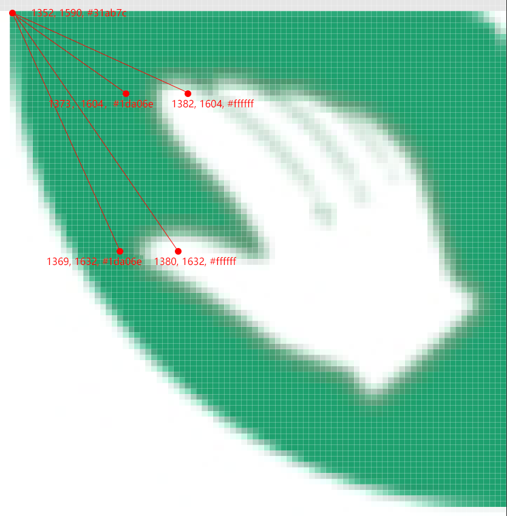

# 简介

基于 Nodejs 的蚂蚁森林自动收能量脚本

# 使用

下载安装 [Autojs](https://github.com/hyb1996/Auto.js) 之后把脚本放进 __"/sdcard/脚本/"__ 文件夹下面

# 配置

由于不同的手机解锁屏幕按键分布和分辨率的不同，对应的识别位置也不一样，因此需要自行设置，具体的设置方法如下

## 如何获取所需图片的信息

首先在手机上对相应页面进行截图，然后将截图原图用 PhotoShop 打开，标尺右键选择像素，然后打开“窗口->信息”，鼠标移动到图片相应位置所需的颜色、位置信息

## 添加设备解锁数字按键位置

数组的0\~9下标对应手机解锁时数字按键的0\~9

```javascript
const devices = {
  HUAWEI_P10_Plus: [{x: 720, y: 2320}, {x: 300, y: 1360}, {x: 720, y: 1360}, {x: 1150, y: 1360}, {x: 300, y: 1680}, {x: 720, y: 1680}, {x: 1150, y: 1680}, {x: 300, y: 2000}, {x: 720, y: 2000}, {x: 1150, y: 2000}],
}
```

## 添加对应手机/分辨率下的多点找色配置

```javascript
const multi_colors = {
  HUAWEI_P10_Plus: {prime: "#30ab7c", extra: [[29, 16, "#ffffff"], [28, 42, "#ffffff"]]},
}
```

其中 prime 是左上角第一个绿色像素点，extra 则是另外两个手指尖端位置的白色像素，其中第一个数字代表该像素相对于绿色像素的x值，第二个数字则代表该像素相对于绿色像素的y值。



## 设置参数

```javascript
const config = {
  device: devices.HUAWEI_P10_Plus,        // 上面填好的设备信息
  discern: multi_colors.HUAWEI_P10_Plus,  // 上面填好的设备信息
  passwd: "123456",                       // 解锁密码
  times: 10                               // 循环收取次数
}
```

