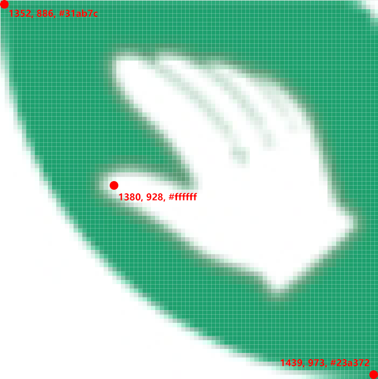

# 简介

基于 Autojs 的蚂蚁森林自动收能量脚本

# 使用

下载安装 [Autojs](https://github.com/hyb1996/Auto.js) 之后把整个脚本项目放进 __"/sdcard/脚本/"__ 文件夹下面。原旧版脚本移动到 “old” 目录下。

# 功能

- 自动匹配不同系统下自动化的方式，安卓7及以上通过无障碍服务模拟操作，以下版本通过 root 权限模拟操作；
- 自动识别屏幕锁定方式并根据配置的密码解锁，支持图形解锁，PIN解锁，混合密码解锁；
- 识别自己能量球的倒计时，和好友列表中的倒计时做对比，取最小值作为下次收取的等待时间；
- 收取完毕后悬浮框显示收取的能量数量。

# 配置

打开 config.js 后可以看到如下配置：

```javascript
var config = {
  discern: {prime: "#31ab7c", extra: [[28, 42, "#ffffff"], [87, 87, "#23a372"]]},
  password: "52897",
  max_unlock_retry: 3,
  max_collect_repeat: 20,
  max_collect_wait_time: 20
};
```

其中：

- discern：用来识别可收集标志，采用多点找色的办法，取点的方法见下图；
- password：手机解锁密码，如果是图形解锁则为图形经过的点对应的数字；
- max_unlock_retry：解锁最大尝试次数；
- max_collect_repeat：脚本重复收取的最大次数；
- max_collect_wait_time：等待好友收取能量倒计时的最大值。

## 如何获取所需图片的信息

首先在手机上对相应页面进行截图，然后将截图原图用 PhotoShop 打开，标尺右键选择像素，然后打开“窗口->信息”，鼠标移动到图片相应位置所需的颜色、位置信息

- prime：下图所示左上角第一个像素点；
- extra：下图所示2个额外像素点，其中每一个额外像素颜色信息中第一个数字代表该像素相对于 prime 像素点的 x 值，第二个数字则代表该像素相对于 prime 像素点的 y 值；



# 注意事项

解锁仅支持：

- 具有ROOT权限的安卓5.0及以上版本
- 没有ROOT权限的安卓7.0及以上版本

# 目前存在的问题

- 某些未ROOT设备无法解锁混合密码
- Autojs 在锁屏状态下由于软件优先度被降低导致 sleep() 函数时间不准确

