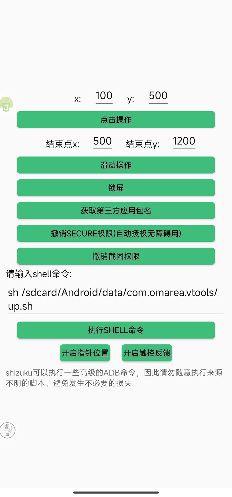

[](https://github.com/TonyJiangWJ/Ant-Forest/forks)
[](https://github.com/TonyJiangWJ/Ant-Forest/stargazers)
[](https://github.com/TonyJiangWJ/Ant-Forest/issues)
[](https://badges.toozhao.com/stats/01HV8RHHZDJW7G9JFE65B6DZZJ "Get your own page views count badge on badges.toozhao.com")

# 蚂蚁森林自动收能量脚本

基于 Auto.js 实现的蚂蚁森林自动化脚本。

## **觉得本项目好用的话请给个 Star 吧~**

## ⚠️ 重要提示：依赖与环境

* **核心依赖**: 本脚本基于 **[AutoJS Modify](https://github.com/TonyJiangWJ/Ant-Forest/releases/download/v1.1.1.4/AutoJS.modify.latest.apk)** 或 **[困鱼 (AutoJS.fake)](https://github.com/TonyJiangWJ/Ant-Forest/releases/download/v1.1.1.4/AutoJS.fake.latest.apk)** 开发和运行。
  * **不兼容**: 不再支持原版 4.1.1（已删库且问题多）、官方 Pro 版（限制无障碍、代码审查）。
  * **更多版本下载**: `https://wwxs.lanzouq.com/b042le51i` (密码: `b034`)
  * **修改版 Auto.js 源代码**: [TonyJiangWJ/Auto.js](https://github.com/TonyJiangWJ/Auto.js)
* **系统要求**:
  * 安卓 7.0 及以上版本 (无需 ROOT)。
  * 安卓 5.0 - 6.x 版本 (需要 ROOT 权限)。
* **显示要求**: 脚本依赖图像识别，请**关闭**手机的**护眼模式**、**深色模式 (暗色模式)** 等可能影响屏幕颜色的功能。
* **项目渊源**: 本项目是在 [Nick-Hopps/Ant-Forest-autoscript](https://github.com/Nick-Hopps/Ant-Forest-autoscript) (原作者 [Nick-Hoops](https://github.com/Nick-Hopps) 已不再维护) 的基础上发展而来，虽然代码已大幅重构，但仍感谢原作者的开创性工作。解锁模块参考自 [e1399579/autojs](https://github.com/e1399579/autojs)。

## ✨ 主要功能

* **自动收能量**:
  * 通过“逛一逛”高效收集好友能量。
  * 识别并跳过开启能量护罩的好友。
  * 识别能量球倒计时，智能安排下次收取时间。
* **多种运行模式**:
  * **计时模式**: 根据识别到的最小倒计时启动，可设置最大等待时间。
  * **循环模式**: 按设定次数不间断执行。
  * **永不停止模式**: 无倒计时或超过设定时间则按设定间隔启动，实现全天候运行。
* **智能解锁**:
  * 自动识别屏幕锁定方式 (图形、PIN、密码)。
  * 支持支付宝手势解锁。
  * 支持扩展自定义解锁方式。
* **多账号支持**:
  * 自动切换小号进行能量收集、能量雨、同步步数。
  * 能量雨自动按顺序赠送机会给配置的其他账号。
* **辅助功能**:
  * 自动使用双击卡 (可配置时间段)。
  * 自动浇水回馈 (可配置阈值、数量、黑名单)。
  * 自动执行能量雨 (支持赠送好友机会)。
  * 自动执行保护地巡护。
  * 自动收集神奇海洋能量 (需关闭 3D 模式)。
* **高级特性**:
  * **YOLO 目标检测**: (实验性) 更智能地识别能量球 (需下载模型)。
  * **Shizuku 支持**: (实验性) 通过 Shizuku 获取更高权限 (如自动开启无障碍)。
  * **可视化配置**: 通过 `可视化配置.js` 轻松管理所有设置。
  * **配置导入/导出**: 方便备份和恢复配置。
  * **自定义扩展**: 支持添加自定义解锁和锁屏逻辑。
  * **运行状态显示**: 悬浮窗实时展示脚本状态和收集结果。
  * **运行控制**: 音量键可延迟或终止脚本。
  * **能量统计**: 图表化展示每日/每小时能量收集情况。
* **健壮性**:
  * 通话状态监听 (来电时自动延迟)。
  * 设备姿态检测 (防止锁屏状态下误触)。
  * 自动开启无障碍服务 (需 ADB 或 Shizuku 授权)。

## 🚀 使用入门

1. **环境准备**:
    * 下载并安装 **[AutoJS Modify](https://github.com/TonyJiangWJ/Ant-Forest/releases/download/v1.1.1.4/AutoJS.modify.latest.apk)** 或 **[困鱼](https://github.com/TonyJiangWJ/Ant-Forest/releases/download/v1.1.1.4/AutoJS.fake.latest.apk)**。
    * 将整个脚本项目文件夹放置到设备的 **`/sdcard/脚本/`** 目录下。
2. **授权与设置**:
    * 打开 AutoJS 应用，下拉刷新列表，找到本项目。
    * 授予 AutoJS **`后台弹出界面`**、**`显示悬浮窗`**、**`自启动`**、**`电量无限制`** 等必要权限。
    * 保持 AutoJS 应用在后台运行（加入电池优化白名单）。
    * (可选) [通过 ADB 授权脚本自动开启无障碍权限](#自动开启无障碍权限)。
3. **首次配置 (重要!)**:
    * **必须**: 首次运行前，请务必运行 `可视化配置.js` 进行个性化设置，特别是图像相关的配置，否则脚本很可能无法正常工作。详见 [配置](#⚙️-配置) 小节。
4. **运行脚本**:
    * 直接运行项目或 `main.js`。
5. **定时任务**:
    * 如需定时自动运行，点击 `main.js` 右侧的菜单按钮，选择 `更多` -> `定时任务` 进行配置。
6. **单脚本运行**:
    * 如果遇到提示“有任务正在队列中”，请运行 `可视化配置.js` -> `高级设置` -> 勾选 `单脚本运行`。

## ⚙️ 配置

通过运行 `可视化配置.js` 进行所有设置。

* **基本操作**:
  * 配置项按类别分组，点击进入相应菜单。
  * 列表项可 **左滑** 进行删除或修改。
  * 部分输入框 (如区域、颜色) 可 **左滑** 触发高级编辑控件。
  * 右上角菜单可 **重置所有配置** 为默认值。
* **配置管理**:
  * 右上角菜单可 **导出/导入** 配置到 `local_config.cfg` 文件。
  * 默认使用设备 Android ID 加密，仅本机可用。
  * 跨设备或跨版本同步，需手动获取 `device.getAndroidId()` (运行 `setClip(device.getAndroidId())` 复制) 并在导入时输入。
  * 运行时数据 (如统计) 的导出/导入方式同上。
* **图像识别配置 (核心)**:
  * **注：** 当开启YOLO识别后，可以跳过该配置，但是也可以配置部分图片用于YOLO识别失败时的保底
  * **重要**: 由于手机分辨率和界面差异，**必须** 前往 `查找图片设置`，按照说明截取你手机上对应的图片，特别是 **逛一逛按钮** 等关键识别点。
  * **好友能量球区域**: 前往 `图像识别相关配置` 进行设置。
    * 点击 `实时查看可视化配置信息` 按钮可预览当前框选区域。
    * 运行 `test/全局悬浮窗显示-配置信息.js` 可在支付宝界面上叠加显示配置区域，方便调整。
    * 可在 `resources` 目录下放置截图 `region_check.jpg` 作为 `可视化配置.js` 的背景参考。
    * 区域输入框可左滑使用拖动控件调整。
  * **一键收能量**: 需要自行配置对应图片才能生效。
* **OCR 配置**:
  * 用于识别倒计时等文字信息。
  * **优先级**: mlkit-ocr (需[插件](https://github.com/TonyJiangWJ/Ant-Forest/releases/download/v1.1.1.4/mlkit-ocr-plugin-latest.apk)或修改版AutoJS) > PaddleOCR (需修改版AutoJS且耗电) > 百度OCR (需API Key且有次数限制)。
  * **mlkit-ocr**: 速度快，准确性尚可，基本满足需求。
  * **PaddleOCR**: 准确性高，速度慢，**必须使用修改版 AutoJS** 并设置电量无限制。
  * 可在 `可视化配置.js` 中调整 OCR 相关设置。

## 🧩 功能详解

### 核心运行模式说明

* **计时模式 (默认)**:
  * 关闭 `循环模式` 和 `永不停止模式` 时启用。
  * 识别好友列表中的倒计时，取最小值。
  * 如果最小值 < `最大等待时间` (可在配置中修改，默认60分钟)，则按最小值等待后启动。
  * 否则，脚本停止执行 (等待下一次定时任务)。
* **循环模式**:
  * 在配置中启用 `循环模式` 并设置次数。
  * 脚本会不间断地执行指定次数后停止。
* **永不停止模式**:
  * 关闭 `循环模式` 并启用 `永不停止模式`。
  * 需要设置 `重新激活时间` (可设为固定值或随机范围)。
  * 如果识别到的最小倒计时 < `重新激活时间`，则按倒计时等待。
  * 如果识别到的最小倒计时 >= `重新激活时间` (或无倒计时)，则按 `重新激活时间` 等待后启动。
  * 实现全天候不间断运行。
* **自定义模式脚本**:
  * `unit` 目录下提供了预设模式的快捷启动脚本，执行后会中断当前任务并按新模式启动：
    * `自定义1永不停止.js`: 25-35分钟随机轮询，适合白天 (如设置每天9点定时任务)。
    * `自定义2计时停止.js`: 按倒计时执行 (最长等60分钟)，适合早晚收尾 (如设置7点、23点、0点定时任务)。
    * `自定义3循环千次只收自己.js`: 循环收自己能量，适合能量生成前运行 (如生成前1分钟定时启动，2分钟后用 `自定义2` 停止)。
  * 可参考这些文件创建自己的模式。

### 多账号功能

1. **配置**: 运行 `可视化配置.js` -> `多账号管理`，添加支付宝账号并设置 **昵称** (用于能量雨赠送)，并勾选一个 **主账号**。确保添加的账号在当前设备可免密登录切换。
2. **运行脚本**:
    * **自动收集**: `unit/循环切换小号并收集能量.js` (支持小号给大号浇水)。
    * **自动能量雨**: `unit/循环切换小号并执行能量雨收集.js` (建议关闭主脚本的自动能量雨)。能量雨会按 A->B->C->A 的顺序自动赠送机会。
    * **自动同步步数**: `unit/循环切换小号用于同步数据.js`。
    * **森林集市**: `unit/循环切换小号执行森林集市.js`
3. **定时任务**: 为需要的脚本设置定时任务。

### 能量雨收集

* **手动启动**: 运行 `unit/能量雨收集.js` (或在可视化配置中开启对应开关)，然后进入能量雨界面手动点击开始，脚本会自动接管。
* **自动启动 (无小号)**: 对 `unit/自动启动并执行能量雨.js` 创建定时任务。
* **自动启动 (有小号)**: 使用 `unit/循环切换小号并执行能量雨收集.js` 的定时任务。
* **配置**:
  * 可配置自动赠送好友机会 (支持正则匹配好友名)。
* **效果**: 暴力点击，基本保证满分。

### 自动巡护

* **运行**: 运行 `unit/自动巡护.js` 或为其创建定时任务。
* **功能**: 自动将当日步数兑换为 5 次巡护机会，并执行巡护 (每日保底 3+5 次)。

### 森林集市

* **运行**: 运行 `unit/森林集市.js` 或为其创建定时任务。
* **功能**: 自动浏览森林集市中的商品以获取相应的奖励能量

### 神奇海洋收集

* **运行**: 对 `unit/神奇海洋收集.js` 创建每天 7 点后的定时任务。
* **配置**:
  * `可视化配置` -> `图像识别相关配置` -> `神奇海洋相关配置`，按提示配置 OCR 区域、垃圾球角标位置等。
  * 需要 OCR 支持 (至少安装 MlKitOCR 插件或使用修改版 AutoJS)。
* **重要**: 默认无法通过无障碍点击收集，请**务必**在支付宝的神奇海洋设置中 **关闭 3D 模式** (入口: 神奇海洋右上角三点菜单 -> 设置 -> 关闭“3D模式”)。
* 脚本会尝试 Shizuku 点击，若已关闭 3D 模式，忽略日志中的相关提示即可。

### 自动开启无障碍权限

* 需要 ADB 或 Shizuku 授权 `WRITE_SECURE_SETTINGS` 权限给 AutoJS。
* **ADB 命令** (请将包名替换为你使用的 AutoJS 版本，可通过 `context.getPackageName()` 获取):

    ```shell
    adb shell pm grant org.autojs.autojs.modify android.permission.WRITE_SECURE_SETTINGS
    ```

* **详细教程**: [通过ADB授权脚本自动开启无障碍权限](https://github.com/TonyJiangWJ/AutoScriptBase/blob/master/resources/doc/ADB%E6%8E%88%E6%9D%83%E8%84%9A%E6%9C%AC%E8%87%AA%E5%8A%A8%E5%BC%80%E5%90%AF%E6%97%A0%E9%9A%9C%E7%A2%8D%E6%9D%83%E9%99%90.md)

### 能量统计

* 脚本会自动记录能量收集数据。
* 可在 `可视化配置.js` 中查看图表化的统计信息。
* 
  
  

## 🔧 高级定制

在脚本根目录下新建 `extends` 文件夹，进行以下自定义：

### 自定义设备解锁

* **获取控件信息**: 运行 `unit/获取锁屏界面控件信息.js`，根据提示操作获取布局信息。
* **创建文件**: `extends/ExternalUnlockDevice.js`
* **编写代码**: 参考 `extends/ExternalUnlockDevice-demo.js` 实现 `unlock` 方法。
* **测试**: 运行 `test/测试解锁.js`。

```javascript
// ExternalUnlockDevice.js 示例结构
module.exports = function (obj) {
  this.__proto__ = obj; // 继承原型

  this.unlock = function(password) {
    // 在此处编写你的设备解锁逻辑代码
    // 例如：滑动、输入密码等

    // 必须返回解锁检查结果
    return this.check_unlock();
  };
};
```

### 自定义锁屏代码

* **前提**: 非 ROOT 设备安卓 9 以上通常可通过无障碍服务锁屏，无需此定制。若无障碍锁屏失败，可使用此方法。
* **创建文件**: `extends/LockScreen.js`
* **编写代码**: 参考 `extends/LockScreen-demo.js` 实现自定义锁屏逻辑。
* **测试**: 运行 `test/TestLockScreen.js`。

```javascript
// LockScreen.js 示例结构
let { config: _config } = require('../config.js')(runtime, global); // 注意 global 可能需要根据上下文调整

module.exports = function () {
  // 在此处编写你的锁屏逻辑代码
  // 例如：下拉通知栏点击锁屏按钮
  // swipe(800, 10, 800, 1000, 500); // 示例：下拉
  // sleep(500);
  // click(parseInt(_config.lock_x), parseInt(_config.lock_y)); // 示例：点击锁屏按钮坐标
};
```

### 分享你的配置

* 欢迎将你的自定义扩展代码 (如解锁脚本) 提交到 **[share_configs 分支](https://github.com/TonyJiangWJ/Ant-Forest/tree/share_configs)** 的 `extends` 目录下。
* 命名建议: `ExternalUnlockDevice-手机型号.js`。
* 其他用户可前往该分支下载使用。

## 💡 实验性功能

### YOLO 目标检测

* **优势**: 理论上可以更智能地识别能量球，减少对固定图片和区域配置的依赖。
* **前提**:
  * 使用最新版 **[AutoJS Modify](https://github.com/TonyJiangWJ/Ant-Forest/releases/download/v1.1.1.4/AutoJS.modify.latest.apk)** 或 **[困鱼](https://github.com/TonyJiangWJ/Ant-Forest/releases/download/v1.1.1.4/AutoJS.fake.latest.apk)**。
  * 运行 `独立工具/模型下载.js` 下载 YOLO 模型 (`forest_lite.onnx`)。若下载失败，请手动下载 (`https://wwxs.lanzoup.com/b042le51i` 密码: `b034`) 并解压到 `./config_data/` 目录下。
* **启用**: `可视化配置` -> `图像识别相关配置` -> 打开 `使用YOLO模型识别能量球`。若环境不支持或模型未下载，将自动降级。
* **性能**: YOLO 识别速度约 100ms，传统方案约 30-40ms，请自行取舍。默认关闭。

### Shizuku 支持

* **优势**: 可通过 Shizuku 获取更高权限，实现如自动授权无障碍等功能。
* **前提**:
  * 安装并激活 Shizuku (详见 Shizuku 官方文档)。
  * 使用最新版 **修改版 AutoJS** 或 **困鱼**。
  * 在 AutoJS 的抽屉菜单中启用 Shizuku 并授权。
* **示例**: `独立工具/shizuku示例工具.js` 包含通过 Shizuku 授权媒体权限、写入 Secure 设置 (用于自动开无障碍) 等示例。
    

## 🔄 脚本更新

* 运行 `update/检测更新.js` 检查并更新脚本。
* 也可在 `可视化配置.js` 的右上角菜单中进行更新。
* 支持覆盖更新或备份后更新。

## ❓ 常见问题 (FAQ)

* **可视化配置.js 异常/白屏/加载失败**:
  * 尝试运行 `unit/功能测试-重置默认配置.js`。
  * 确保使用的是推荐的 AutoJS 版本 (Modify 或 困鱼)。
  * 强制关闭 AutoJS 应用后重试，可能是网络资源加载问题。
* **报错 `Function importClass must be called with a class;...`**:
  * 强制关闭 AutoJS 应用再打开。通常发生在跨版本更新后，新版脚本已尝试解决。
* **运行异常/卡顿**:
  * 强制关闭 AutoJS 应用后重试。
  * 建议定期强制关闭 AutoJS，避免内存占用过高。
* **图像识别遗漏/不准**:
  * 检查是否关闭了**护眼模式/深色模式**。
  * 尝试在 `可视化配置` 中调低 `颜色相似度` (默认已改为 20)。
  * 确保关键图片 (如逛一逛) 已按自己手机截图替换。
* **报错 `获取截图失败多次`**:
  * 在 `可视化配置` -> `高级设置` 中，尝试增加 `获取截图等待时间` (默认 500ms)，或取消勾选 `是否异步等待截图`。
* **定时任务不准时**:
  * 检查系统电池优化设置，将 AutoJS 设为无限制/允许自启动/后台运行。
  * 系统限制严格时，可考虑使用 Tasker 等工具通过广播触发脚本执行 (需自行研究)。
* **基于图像分析收取不正常**:
  * 若开启 `是否直接基于图像分析收取和帮助好友` 后运行异常，先取消勾选。
  * 尝试勾选 `区域点击来收取能量`，并根据需要扩展自定义区域点击代码 (目前无直接扩展接口，需修改源码或等待后续支持)。

## 🐞 问题反馈

1. **开启日志**: 在 `可视化配置.js` -> `高级设置` 中，勾选 `保存日志到文件`，并将 `日志文件大小` 调整为 1024KB 或更大。
2. **复现问题**: 重新运行脚本直到问题出现。
3. **收集信息**:
    * 详细描述问题现象、操作步骤。
    * 提供使用的脚本版本、AutoJS 版本、手机型号、安卓版本。
    * 长截图AutoJS软件中的日志，可以的话再附上日志文件 (`logs/log-verboses.log`)。日志默认保存 100k，旧日志在 `logs/logback`。
    * 如有截图或录屏更有助于定位问题。
4. **提交**:
    * **[创建 ISSUE](https://github.com/TonyJiangWJ/Ant-Forest/issues/new)** (推荐)。
    * **[前往论坛反馈](https://autoscripts.flarum.cloud)** 邮箱注册即可，常见的问题后续会逐渐完善上去
    * 如果日志包含隐私信息，可删除敏感部分或通过邮件发送给开发者: `tonyjiangwj@gmail.com`。

## ⚠️ 已知问题

* 收集完一个好友后，可能因未能立即获取其新生成的能量球倒计时而导致少量漏收。
* 部分系统 (如 MIUI) 的省电策略可能导致 AutoJS 定时任务不准时 (非脚本问题)。
* 通话状态监听功能可能不稳定，且 Pro 版无法使用。

## 🔗 相关项目

* **[蚂蚁庄园脚本](https://github.com/TonyJiangWJ/Ant-Manor)**
* **[聚合签到-签到薅羊毛](https://github.com/TonyJiangWJ/Unify-Sign)**
* **[AutoScriptBase](https://github.com/TonyJiangWJ/AutoScriptBase)**: 用于快速开发 AutoJS 脚本的基础项目。

## 📜 更新记录

* 详细的历史版本更新记录请查看 **[RELEASES 页面](https://github.com/TonyJiangWJ/Ant-Forest/releases)**。
* 更早的记录可参考旧仓库 [RELEASES(旧仓库)](https://github.com/TonyJiangWJ/Ant-Forest-autoscript/releases)。

## ☕ 支持开发者

如果觉得项目对你有帮助，欢迎请我喝杯咖啡！

* 一元喝速溶、五元喝胶囊、十二买全家、三十三买星巴克，感激不尽！

| 支付宝 | 微信 | 也欢迎支付宝扫码领红包，你领我也得，双赢！ |
| :----: | :----: | :----: |
|  |  |  |

* 也可以运行 `unit/支持作者.js` 在线获取红包口令，通过支付宝直接打开领取，每使用一个红包我都可以获取一分钱的收益。如果你不嫌烦的话可以给 `unit/支持作者自动版.js` 设置定时任务，每天自动领取。

### 🙏 感谢名单 (部分)

<details>
  <summary>Alipay</summary>
  <div>*剑</div>
  <div>**杰</div>
  <div>**佑</div>
  <div>**豪</div>
  <div>**旸</div>
  <div>**渔</div>
  <div>**真</div>
  <div>**刚</div>
  <div>**刚</div>
  <div>**亚</div>
  <div>**成</div>
  <div>*毅</div>
  <div>**杰</div>
  <div>*之</div>
  <div>**旸</div>
  <div>*硕</div>
  <div>**杰</div>
  <div>**宏</div>
  <div>**鲁</div>
  <div>*赟</div>
  <div>*鹏</div>
  <div>**杰</div>
  <div>**恒</div>
  <div>*鹏</div>
  <div>**光**彬</div>
  <div>**胜</div>
  <div>**庭</div>
  <div>**光</div>
  <div>**杰</div>
  <div>**俊</div>
  <div>*森</div>
  <div>*悦</div>
  <div>*森</div>
  <div>*剑</div>
  <div>**亮</div>
  <div>*伟</div>
  <div>**飞</div>
  <div>**骞</div>
  <div>**旻</div>
  <div>**锟</div>
  <div>**锟</div>
  <div>**锟</div>
</details>
<details>
  <summary>WeChat</summary>
  <div>z*g</div>
  <div>*鸟</div>
  <div>*鸟</div>
  <div>*明</div>
  <div>*妖</div>
  <div>**昌</div>
  <div>**昌</div>
  <div>**昌</div>
  <div>*济</div>
  <div>*🧸</div>
  <div>A*g</div>
  <div>**昌</div>
  <div>**昌</div>
  <div>*信</div>
  <div>**昌</div>
  <div>*涛</div>
  <div>J*k</div>
  <div>*🍅</div>
  <div>*🧸</div>
  <div>F*sW</div>
  <div>**昌</div>
  <div>F*sW</div>
  <div>**昌</div>
  <div>*z</div>
  <div>**昌</div>
  <div>**昌</div>
  <div>*🍃</div>
  <div>w*x</div>
  <div>*邱</div>
  <div>G*n</div>
  <div>*河</div>
  <div>*己</div>
  <div>*漏</div>
</details>
